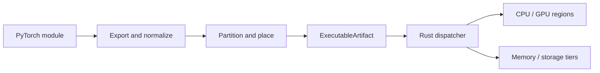

<p align="center">
  
</p>

<h1 align="center">StreamCompiler</h1>

<p align="center">
  A heterogeneous PyTorch compiler and runtime for one machine with many CPUs,
  GPUs, and memory tiers.
</p>

<p align="center">
  <a href="https://github.com/alhussein-jamil/TensorTorrent/actions/workflows/ci.yml"></a>
  <a href="https://github.com/alhussein-jamil/TensorTorrent/tags"></a>
  
  
  <a href="LICENSE"></a>
</p>

StreamCompiler exports a PyTorch model, partitions its graph, places regions
across available compute, and runs the resulting schedule through a Rust data
plane. Parameters can stream from slower storage and activations can spill when
the model exceeds device or host memory.

Python compiles. Rust schedules. One immutable `ExecutableArtifact` describes
the program.

> [!IMPORTANT]
> StreamCompiler is alpha software. The supported target is Linux with PyTorch
> 2.4 or newer. Validate every deployment machine before serving production
> traffic.

## Quick start

The project currently installs from source. You need
[uv](https://docs.astral.sh/uv/) and a Rust toolchain.

```bash
git clone https://github.com/alhussein-jamil/TensorTorrent.git
cd TensorTorrent
make sync
make doctor
```

Compile a module and compare it with eager PyTorch:

```python
import torch
import torch.nn as nn
import streamcompiler as sc

model = nn.Sequential(
    nn.Linear(256, 256),
    nn.ReLU(),
    nn.Linear(256, 10),
).eval()
x = torch.randn(32, 256)

compiled = sc.compile(model, example_inputs=(x,))
torch.testing.assert_close(compiled(x), model(x), check_device=False)

compiled.save("artifact/")
reloaded = sc.load_compiled("artifact/")
```

Run `uv run python examples/public_api_demo.py` for hardware discovery, compile,
and schedule output in one executable example.

## What it handles

| Area | Implementation |
| --- | --- |
| PyTorch export and graph partitioning | [`python/streamcompiler/compile`](python/streamcompiler/compile) |
| CPU, CUDA, ROCm, Intel XPU, and plugin discovery | [`python/streamcompiler/backends`](python/streamcompiler/backends) |
| NUMA-aware host allocation | [`crates/sc-backend-cpu`](crates/sc-backend-cpu) |
| Scheduling, residency, transfer, and cancellation | [`crates/sc-runtime`](crates/sc-runtime) |
| Parameter streaming and activation spill | [`crates/sc-storage`](crates/sc-storage) |
| Atomic, checksummed artifact bundles | [`python/streamcompiler/artifact_io.py`](python/streamcompiler/artifact_io.py) |
| Concurrent request serving | [`python/streamcompiler/serve`](python/streamcompiler/serve) |
| Virtual accelerators for deterministic tests | [`crates/sc-backend-virtual`](crates/sc-backend-virtual) |

The runtime supports NCCL, RCCL, oneCCL, Gloo, and explicit host-staged
collective fallbacks where the installed hardware and libraries allow them.

## Architecture



The Python control plane owns export, normalization, partitioning, region
compilation, public APIs, and diagnostics. The Rust data plane owns the
artifact, schedule, workers, residency, transfers, storage, cancellation, and
telemetry. Torch compute regions may call back into Python; scheduling and data
movement remain in Rust.

See the [architecture guide](docs/architecture/architecture.md) for ownership
boundaries and [backend contracts](docs/architecture/backends.md) for extension
points.

## Module composition

Compile a sequence as one graph to avoid opaque transfers between separately
compiled artifacts:

```python
compiled = sc.compile_modules(
    [encoder, projector, decoder],
    example_inputs=(x,),
    names=["encoder", "projector", "decoder"],
)
```

For branches, joins, structured arguments, or nested outputs, build a
`ModuleGraph` from `ModuleNode`, `GraphInput`, and `NodeOutput`. Invalid names,
forward references, and output paths are rejected before export.

## Opt-in training

Compilation is inference-only by default. Set `allow_training=True` to use the
same heterogeneous schedule with autograd:

```python
config = sc.CompileConfig(allow_training=True)
compiled = sc.compile(model, example_inputs=(x,), config=config)

optimizer = torch.optim.Adam(compiled.parameters())
compiled.train()
optimizer.zero_grad()
loss = compiled(x).sum()
loss.backward()
optimizer.step()
compiled.eval()
```

Training cannot currently be combined with NVMe parameter streaming,
activation spill budgets, or process workers. See the full
[product scope](docs/product/PRODUCT.md) for intentional limits.

## Development

```bash
make sync                 # create the environment and build the native extension
make check                # lint, types, Rust tests, Python tests, doctor
make native-gate          # native extension smoke and execution checks
make hardware-test        # explicit: may consume most available VRAM or spill space
```

CI runs the architecture-neutral suite on Python 3.10 and 3.12, Linux x86-64
and ARM64, then builds and smoke-tests the production CPU container. Hardware
tests stay opt-in because they are target-specific and resource-intensive.

Read [CONTRIBUTING.md](CONTRIBUTING.md) before changing planner, discovery, or
backend behavior.

## Repository map

```text
python/streamcompiler/   Python control plane, public API, and serving
crates/sc-*/             Rust IR, runtime, memory, storage, backends, and FFI
tests/                   Unit, integration, end-to-end, property, and hardware tests
docs/                    Product, architecture, deployment, and reference guides
examples/                Small public API programs
bench/                   Runtime and planner comparisons
tools/                   Local quality and native-extension gates
```

## Documentation

- [Product scope](docs/product/PRODUCT.md)
- [Architecture](docs/architecture/architecture.md)
- [Heterogeneous hardware planning](docs/architecture/heterogeneous_hardware.md)
- [Deployment and target validation](docs/product/deployment.md)
- [FAQ](docs/reference/faq.md)
- [Anti-patterns](docs/reference/anti_patterns.md)

## Versions and releases

Versions follow [Semantic Versioning](https://semver.org/) and release tags use
`vMAJOR.MINOR.PATCH`. CI verifies that Python metadata, Rust workspace metadata,
the public `__version__`, the tag, and the changelog agree. Release publication
is manual; the exact process is in [docs/RELEASING.md](docs/RELEASING.md).

## License

Apache-2.0. See [LICENSE](LICENSE).
