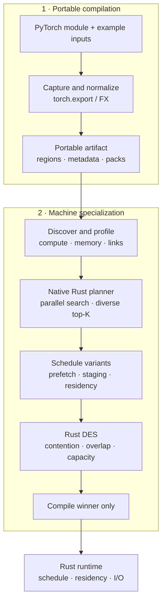

<p align="center">
  
</p>

<p align="center">
  <strong>Heterogeneous execution planning for PyTorch on a single machine.</strong><br>
  Profile → plan → simulate → compile → run across CPUs, GPUs, memory, and storage.
</p>

<p align="center">
  <a href="https://github.com/alhussein-jamil/TensorTorrent/actions/workflows/ci.yml"></a>
  <a href="https://pypi.org/project/tensortorrent/"></a>
  <a href="https://pypi.org/project/tensortorrent/"></a>
  
  
  
  <a href="LICENSE"></a>
  <a href="https://github.com/alhussein-jamil/TensorTorrent/stargazers"></a>
</p>

<p align="center">
  <a href="#install">Install</a> ·
  <a href="#quick-start">Quick start</a> ·
  <a href="#why-tensortorrent">Why</a> ·
  <a href="#architecture-at-a-glance">Architecture</a> ·
  <a href="#documentation">Docs</a> ·
  <a href="CONTRIBUTING.md">Contributing</a>
</p>

---

TensorTorrent compiles a PyTorch model for the resources that are actually available on a host. It profiles compute and transfer paths, searches heterogeneous placements in a native Rust planner, simulates the strongest schedule candidates, then compiles and executes the winner.

The target is not “make one GPU faster.” The target is **make the whole machine schedulable**: CPUs, multiple accelerators, host memory, device memory, and storage.

> [!NOTE]
> **Status: alpha.** CPU and virtual backends are covered by architecture-neutral CI. Accelerator support must be validated on the target host with `tensortorrent validate-hardware`.



## Highlights

| | |
| --- | --- |
| **Whole-machine scheduling** | Place work across unequal CPUs/GPUs with real transfer costs, not hand-written `.to(device)` maps. |
| **Native planner + DES** | Rust searches placements; a discrete-event simulator ranks a bounded finalist set before compile. |
| **Memory-aware by default** | VRAM/RAM budgets, parameter streaming, and activation spill when the plan requires it. |
| **Reproducible artifacts** | Save/load compiled plans — inspect with `explain()`, redeploy without recapturing the graph. |
| **Honest hardware story** | Discovery ≠ production-ready. Validation is explicit and host-specific. |

## Install

Install the PyTorch build appropriate for your machine first, then TensorTorrent:

```bash
pip install torch
pip install tensortorrent
```

<details>
<summary><strong>Requirements &amp; source install</strong></summary>

<br>

**Requirements:** Linux · Python 3.10–3.13 · PyTorch 2.4+

```bash
git clone https://github.com/alhussein-jamil/TensorTorrent.git
cd TensorTorrent
make sync
make doctor
```

See [Installation](docs/getting-started/installation.md) for CUDA/ROCm/XPU notes and source builds.

</details>

## Quick start

```python
import torch
import torch.nn as nn
import tensortorrent as tt

model = nn.Sequential(
    nn.Linear(256, 1024),
    nn.GELU(),
    nn.Linear(1024, 256),
).eval()

x = torch.randn(32, 256)
compiled = tt.compile(model, example_inputs=(x,))

y = compiled(x)
torch.testing.assert_close(y, model(x), check_device=False)

print(compiled.explain())
compiled.save("artifact/")
```

Reload without recompiling the portable graph:

```python
compiled = tt.load_compiled("artifact/")
y = compiled(x)
```

## Why TensorTorrent?

<table>
<tr>
<td width="50%" valign="top">

### Good fit when…

- the model does not fit one GPU
- several unequal compute devices are available
- host/device transfer cost shapes placement
- RAM or VRAM budgets must be enforced
- parameters need to stream from slower tiers
- activations need bounded spill
- you want a reproducible plan, not ad-hoc device maps

</td>
<td width="50%" valign="top">

### Not trying to be…

- a multi-node cluster scheduler
- an exhaustive enumerator of every placement
- a guarantee that every detected GPU must be used
- a replacement for PyTorch kernels
- “auto-magic” production readiness from discovery alone

</td>
</tr>
</table>

For a resident one-device graph, TensorTorrent can select a direct execution path so you do not pay schedule-dispatch overhead when the scheduler adds no value.

## What TensorTorrent does

<details open>
<summary><strong>Pipeline capabilities</strong></summary>

<br>

- Captures and partitions a PyTorch graph into executable regions.
- Discovers CPU, CUDA, ROCm, Intel XPU, memory, storage, and transfer resources through backend capability interfaces.
- Measures region and transfer performance when profiling is enabled.
- Searches placements in native Rust with bounded multicore parallelism.
- Keeps multiple competitive placements, including alternatives from the same device subset.
- Builds prefetch/staging variants and evaluates them with a Rust discrete-event simulator.
- Models dependencies, serialized resources, transfer contention, memory residency, spill, and overlap.
- Compiles only the final DES-selected region implementations.
- Executes one immutable schedule through the runtime, with parameter streaming and activation spill when required by budgets.

</details>

<details>
<summary><strong>What it does <em>not</em> claim</strong></summary>

<br>

TensorTorrent does **not** exhaustively simulate every possible placement. The planner narrows a large search space; DES ranks a bounded finalist set.

Hardware discovery also does **not** mean a backend is production-ready on that host. Validation is explicit and target-specific.

TensorTorrent is currently single-host. Multi-node cluster scheduling is outside the project scope.

</details>

## Architecture at a glance

| Layer | Responsibility |
| --- | --- |
| Python frontend | PyTorch capture, graph normalization, partitioning, public API |
| Hardware layer | discovery, topology, budget resolution, measurement |
| `tt-planner` | native placement search and top-K finalist generation |
| `tt-runtime` simulator | detailed schedule feasibility and objective ranking |
| Region compilation | eager FX / `torch.compile` / AOT selection where configured |
| Rust runtime | schedule dispatch, residency, transfers, events, cancellation, telemetry |
| `tt-storage` | parameter packs, prefetch, cache, activation spill |

The important boundary is deliberate: **Python integrates with PyTorch; Rust owns the hot planning and scheduling machinery.** Torch-backed compute regions may still call Python to execute the region body.

Read [Architecture](docs/architecture/architecture.md), [Planner](docs/architecture/planner.md), and [Runtime](docs/architecture/runtime.md) for the detailed model.

## Configure the objective

```python
config = tt.CompileConfig(
    objective=tt.Objective.THROUGHPUT,
    target_inflight_requests=4,
)
compiled = tt.compile(model, example_inputs=(x,), config=config)
```

Supported objectives are `latency`, `throughput`, `memory`, `balanced`, and `weighted`.

Most users should leave planner concurrency on automatic:

```python
config = tt.CompileConfig(
    planner_workers=0,              # auto
    planner_parallel_subsets=True,  # default
)
```

See the complete [configuration reference](docs/reference/configuration.md).

## Large models and memory budgets

TensorTorrent resolves host memory, device memory, CPU, and spill-disk budgets before specialization. Explicit limits override automatically discovered limits.

```python
config = tt.CompileConfig(
    vram_budget_bytes=6 * (1 << 30),
    ram_budget_bytes=24 * (1 << 30),
    allow_nvme_streaming=True,
)
```

See [Running models under memory pressure](docs/guides/large-models.md) and [Resource budgets](docs/product/resource_budgets.md).

## CLI

```bash
tensortorrent doctor
tensortorrent profile --output artifacts/profile
tensortorrent validate-hardware --output artifacts/validation_report.json
tensortorrent benchmark-topology --output artifacts/topology.json
```

See [CLI reference](docs/reference/cli.md).

## Benchmarks

> [!IMPORTANT]
> Benchmark results in this repository are snapshots from a named machine, not universal performance claims.

The harness includes eager PyTorch, `torch.compile`, AOTInductor, ONNX Runtime, and Accelerate where installed.

```bash
uv sync --extra dev --extra bench
uv run python bench/compare_baselines.py --device cpu --iters 50
uv run python bench/planner_native_bench.py
```

See [Benchmarks](docs/product/benchmarks.md) for the measured results and methodology.

## Development

```bash
make sync
make check
make native-gate
```

Real-hardware tests are intentionally separate:

```bash
make hardware-test
```

See [CONTRIBUTING.md](CONTRIBUTING.md) for repository conventions.

## Documentation

Start at the [documentation index](docs/README.md).

| Topic | Link |
| --- | --- |
| Getting started | [Installation](docs/getting-started/installation.md) · [Quickstart](docs/getting-started/quickstart.md) |
| Architecture | [Overview](docs/architecture/architecture.md) · [Planner](docs/architecture/planner.md) · [Runtime](docs/architecture/runtime.md) · [Backends](docs/architecture/backends.md) |
| Guides | [Large models](docs/guides/large-models.md) · [Training](docs/guides/training.md) · [Deployment](docs/product/deployment.md) |
| Reference | [Configuration](docs/reference/configuration.md) · [CLI](docs/reference/cli.md) · [FAQ](docs/reference/faq.md) · [Benchmarks](docs/product/benchmarks.md) |

## Star history

[](https://star-history.com/#alhussein-jamil/TensorTorrent&Date)

## License

Apache License 2.0. See [LICENSE](LICENSE).

---

<p align="center">
  <br>
  <sub>Made for mixed machines — not just mixed kernels.</sub>
</p>
