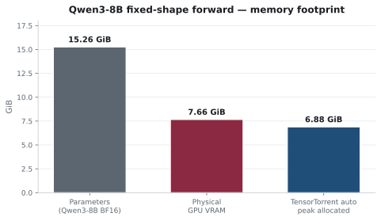
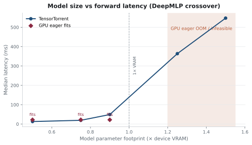
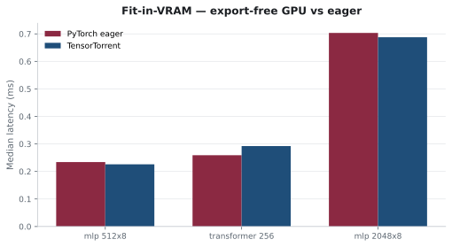

# Benchmarks

Measured capacity and fit-in-VRAM results for TensorTorrent.

TensorTorrent targets models that approach or exceed accelerator memory. Native
PyTorch is expected to be faster for small models that fit comfortably on one
GPU — planning and runtime add overhead there. Beyond VRAM, TensorTorrent
provides capacity and can be competitive with host-offload runtimes.

Host for these numbers: NVIDIA GeForce RTX 3070 Ti Laptop GPU (7.66 GiB) · PyTorch 2.13.0+cu130.
Provenance (commit, packages, raw samples): [`raw/`](raw/).

## Qwen3-8B BF16 — fixed-shape logits forward (`seq_len=16`)

Not autoregressive generation. Parameters **16.38 GB** on **7.66 GiB** physical VRAM.

| Approach | Median ms | Peak VRAM | Notes |
| --- | ---: | ---: | --- |
| GPU eager | — | — | infeasible (params > VRAM) |
| CPU eager | 3153 | 0 | ok |
| **TensorTorrent auto** | **1203** | **7.39 GB** | `transfer_evict` · cosine 0.9997 · argmax 15/16 |
| TensorTorrent forced GPU | 1229 | 7.26 GB | detailed; not the default UX |
| Accelerate (`device_map=auto`) | 1625 | 6.64 GB | tested config only |



## DeepMLP — 1.50× VRAM (12.35 GB params)

| Approach | Median ms | Peak VRAM | Notes |
| --- | ---: | ---: | --- |
| GPU eager | — | — | GPU OOM |
| CPU eager | 429 | 0.08 GB | ok |
| **TensorTorrent auto** | **434** | **0.00 GB** | `direct_export_free` · devices `['cpu_numa_0']` |
| TensorTorrent forced GPU stream | 554 | 7.26 GB | detailed |
| Accelerate (`device_map=auto`) | 768 | 5.38 GB | tested config only |

## Model-size crossover (DeepMLP)



| Size × VRAM | GPU eager | TensorTorrent | Strategy |
| --- | --- | --- | --- |
| 0.50× | fits | 13 ms | `direct_export_free` |
| 0.75× | fits | 19 ms | `direct_export_free` |
| 0.90× | fits | 49 ms | `resident` |
| 1.00× | OOM | fail | `?` |
| 1.10× | OOM | fail | `?` |
| 1.25× | OOM | 364 ms | `transfer_evict` |
| 1.50× | OOM | 547 ms | `transfer_evict` |

## Fit-in-VRAM

When the model fits, native PyTorch is faster:



| Workload | Eager ms | TensorTorrent ms | Peak VRAM |
| --- | ---: | ---: | ---: |
| mlp_512x8 | 0.23 | 0.23 | 26 MB |
| transformer_256 | 0.26 | 0.29 | 24 MB |
| mlp_2048x8 | 0.70 | 0.69 | 152 MB |

## Unmeasured here

Autoregressive generation · multi-GPU · other Accelerate configs · ROCm/XPU.

Full tabular dump: [`REPORT.md`](REPORT.md). Methodology: [`docs/product/benchmarks.md`](../../docs/product/benchmarks.md).

## Reproduce

```bash
uv sync --extra dev --extra bench
python -m benchmarks.public --suite all --out benchmarks/results/current
python -m benchmarks.tooling.freeze --src benchmarks/results/current --dst benchmarks/evidence/raw
python -m benchmarks.tooling.render_evidence --evidence benchmarks/evidence
```
