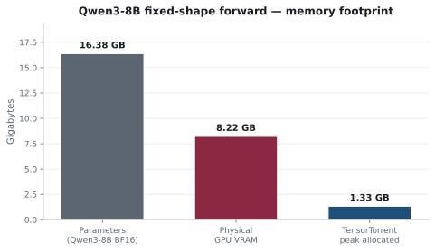
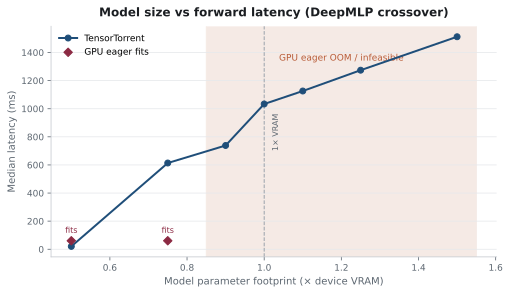
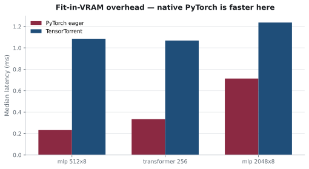

# TensorTorrent 0.3.1 — capacity benchmarks

Frozen **MEASURED** snapshot. Raw evidence: [`raw/`](raw/). Methodology: [`docs/product/benchmarks.md`](../../../docs/product/benchmarks.md).
Figures are regenerated directly from the frozen JSON with `python -m benchmarks.tooling.render_evidence`.

| | |
| --- | --- |
| Package | `0.3.1` |
| Commit | `fb503e5dfb1f072cdf69871d01f33f711151e11d` |
| `git_dirty` | `false` |
| GPU | NVIDIA GeForce RTX 3070 Ti Laptop GPU (7.66 GiB) · 61 GiB RAM · PyTorch 2.13.0+cu130 |

## Headline — Qwen3-8B fixed-shape logits forward

Not autoregressive generation. BF16, `seq_len=16` only.

| | |
| --- | ---: |
| Parameters | **16.38 GB** |
| Physical VRAM | **7.66 GiB** |
| TensorTorrent | **2522 ms** · peak **1.33 GB** |
| CPU eager | 2119 ms |
| Tested Accelerate (`device_map=auto`) | OOM |
| Correctness | cosine ≈ 0.9997 · argmax 15/16 |



## Crossover — residency → Transfer/Evict



| Size × VRAM | GPU eager | TensorTorrent | Strategy |
| --- | --- | --- | --- |
| 0.50× | fits | 20 ms | `resident` |
| 0.75× | fits | 614 ms | `transfer_evict` |
| 0.90×–1.50× | OOM | 738–1512 ms | `transfer_evict` |

## Fit-in-VRAM

When the model fits, native PyTorch is faster:



## Unmeasured here

Autoregressive generation · multi-GPU · other Accelerate configs · ROCm/XPU.

## Reproduce

```bash
python -m benchmarks.public --suite transformer --model-id Qwen/Qwen3-8B --seq-len 16
python -m benchmarks.public --suite crossover
```

Runner and freeze workflow: [`benchmarks/README.md`](../../README.md).
