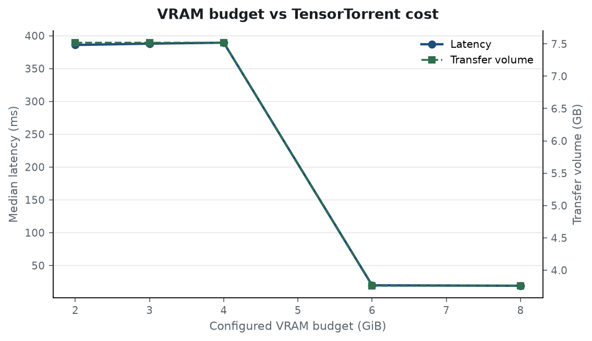
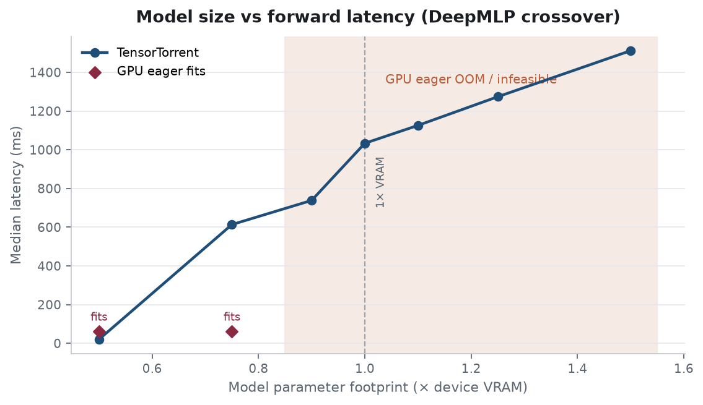
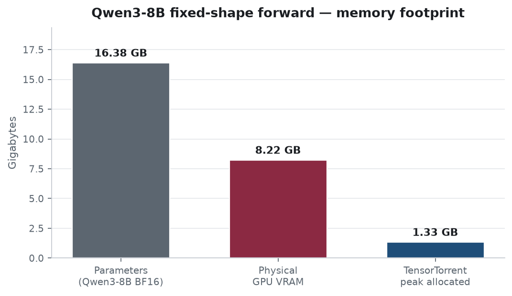

# TensorTorrent 0.3.1 — capacity benchmarks

Human-readable report for the frozen **v0.3.1** evidence.
Machine-readable JSON: [`raw/`](raw/). Figures regenerated from that JSON
(`python -m benchmarks.tooling.render_evidence`).

## Snapshot

| | |
| --- | --- |
| Package | `0.3.1` |
| Measured commit | `fb503e5dfb1f072cdf69871d01f33f711151e11d` |
| `git_dirty` | `False` |
| Host GPU | NVIDIA GeForce RTX 3070 Ti Laptop GPU (7.66 GiB) |
| Host RAM | 61 GiB |
| PyTorch | 2.13.0+cu130 |
| CUDA / driver | 13.0 / 595.84 |

## What this measures

TensorTorrent is a **capacity-oriented** heterogeneous runtime. These benches answer:

1. **Beyond VRAM** — can a fixed-shape forward complete when parameters exceed device memory?
2. **Crossover** — when does residency give way to Transfer/Evict streaming?
3. **Fit-in-VRAM** — what overhead remains when the model already fits?

Autoregressive generation, multi-GPU, and alternate Accelerate configs remain
**SUPPORTED BUT UNMEASURED** on this host.

## Headline — Qwen3-8B fixed-shape logits forward

Not generation. BF16, `seq_len=16`, exportable logits forward only.

| | |
| --- | ---: |
| Parameter footprint | **16.38 GB** |
| Physical VRAM | **7.66 GiB** |
| TensorTorrent median | **2522 ms** |
| TensorTorrent peak allocated VRAM | **1.33 GB** |
| CPU eager median | 2119 ms |
| Tested Accelerate (`device_map=auto`) | OOM |
| Correctness | cosine 0.9996724128723145 · argmax 15/16 |

TensorTorrent keeps peak VRAM far below the parameter footprint by streaming /
Transfer–Evict through the accelerator.

## Figures








## Model-size crossover (DeepMLP)

Resident under the safe headroom fraction; Transfer/Evict near and beyond VRAM.

| Size × VRAM | GPU eager | TensorTorrent | Strategy |
| --- | --- | --- | --- |
| 0.50× | fits | 20 ms | `resident` |
| 0.75× | fits | 614 ms | `transfer_evict` |
| 0.90× | OOM | 738 ms | `transfer_evict` |
| 1.00× | OOM | 1033 ms | `transfer_evict` |
| 1.10× | OOM | 1126 ms | `transfer_evict` |
| 1.25× | OOM | 1274 ms | `transfer_evict` |
| 1.50× | OOM | 1512 ms | `transfer_evict` |

## Reproduce

```bash
uv sync --extra dev --extra bench
python -m benchmarks.smoke
python -m benchmarks.public --suite crossover
python -m benchmarks.public --suite transformer --model-id Qwen/Qwen3-8B --seq-len 16

# Freeze JSON into raw/ (clean tree required), then refresh this report:
python -m benchmarks.tooling.freeze --src benchmarks/results/<run> --dst benchmarks/evidence/v0.3.1/raw
python -m benchmarks.tooling.render_evidence --evidence benchmarks/evidence/v0.3.1
```

Ephemeral outputs stay in `benchmarks/results/` (gitignored).
