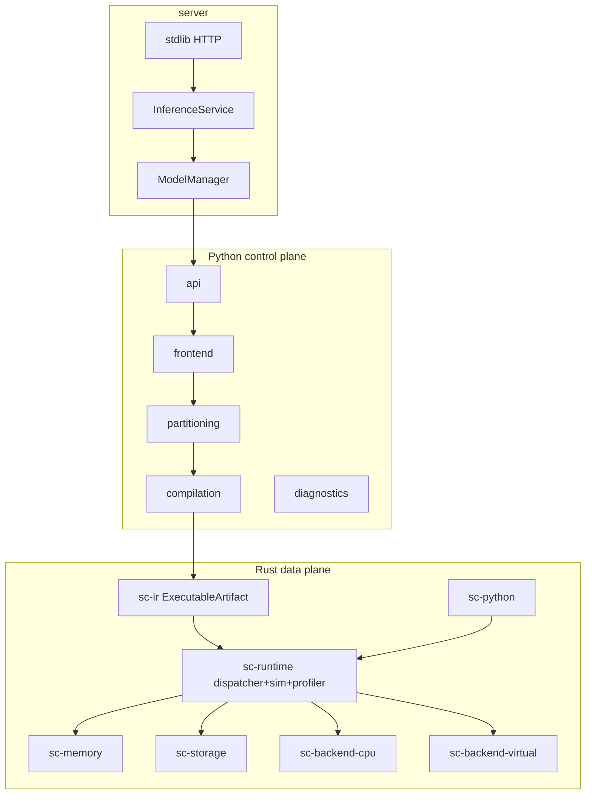

# Migration report — production runtime reorganization

Branch: `refactor/production-runtime`  
Commit base: `3252272` (main)  
Host: Xeon Platinum 8581C, 16 logical CPUs, 1 NUMA node, **no NVIDIA GPU**  
Date: 2026-07-30

## Verdict

**Not production-ready** for real multi-GPU. Architecture reorganized toward one Rust runtime; CPU + virtual path green on this host. CUDA GPU workers **blocked** (no hardware).

## Architecture (final ownership)



## Repository tree

### Before

```
src/streamcompiler/…          # mixed control + runtime Python
crates/streamcompiler-*/      # 9 hyphenated crates
tests/ docs/ benchmarks/
```

### After

```
python/streamcompiler/
  frontend/ ir/ analysis/ planner/ compile/ codegen/
  validation/ observability/ cli/ hardware/ backends/
  _legacy/          # testing-only Python DAG oracle (+ transfers)
  runtime/ …        # migration bridge (callbacks, CompiledModule, device workers)
rust/
  sc-ir/ sc-runtime/ sc-memory/ sc-storage/
  sc-backend-api/ sc-backend-cpu/ sc-backend-virtual/
  sc-python/
server/                       # load / infer / health / metrics / HTTP
tests/ benchmarks/ docs/
Dockerfile
```

## Deleted / isolated

| Item | Action |
| --- | --- |
| `backends/opencl_vulkan.py` | deleted |
| `backends/sycl.py` | deleted |
| `backends/mps.py` | deleted |
| `storage/fastpath.py` | deleted |
| `testing/native_oracle.py` | deleted |
| `runtime/_legacy_dispatch.py` | moved → `_legacy/dispatch.py` |
| `testing/legacy_runtime.py` | moved → `_legacy/runtime.py` |
| Historical `benchmarks/results/*.json` | deleted; fresh run republished |
| `rust/sc-profiler` | merged into `sc-runtime::profiler` |
| `rust/sc-simulator` | merged into `sc-runtime::simulator` |
| Unused facade packages `api/` `compilation/` `partitioning/` `diagnostics/` `python/.../server/` | deleted |
| `runtime/transfers.py` | moved → `_legacy/transfers.py` |
| Unsupported accelerator claims in docs | rewritten |

## Public execution flow

1. `sc.compile` → `torch.export` → regions → pack → specialize → `ExecutableArtifact`
2. `CompiledModule.forward` → Rust `NativeCompiledArtifact.execute` (no schedule reconvert)
3. Rust dispatcher owns residency / events / transfers / storage
4. Python Compute callback still materializes torch regions (migration)

## Backend interface (`sc-backend-api`)

`discover` via capabilities · allocate/free · async copy · launch · record/wait events · synchronize · health · memory_report · cancel_queued.

Resources expose streams, copy engines, NUMA, peer-access, dtypes, artifact formats.

## CPU / GPU deployment model

- **CPU:** `sc-backend-cpu` — one domain per NUMA node, compute/IO pools, thread-env guards, measured host copy bandwidth. Tested: 1 NUMA / 16 CPUs.
- **GPU:** multi-process workers **not implemented yet**. Real CUDA **blocked** (no device). Virtual path exercised via mock_accel + `sc-backend-virtual`.

## Serving

- In-process: `InferenceService` (queue, timeout, backpressure, Prometheus text)
- HTTP: `server.http.HttpServer` / `python -m server.cli --listen HOST:PORT`
  - `GET /health` · `GET /ready` · `GET /metrics` · `POST /v1/infer` (JSON tensors)

## Test results

| Suite | Result |
| --- | --- |
| `cargo test -p sc-runtime` | **16 passed** (incl. profiler + simulator) |
| `cargo test --workspace` (excl. pyo3 build) | pass |
| `cargo clippy -D warnings` (sc-runtime + sc-python) | pass |
| `pytest -q` | **349+ passed** (server HTTP added) |
| `tests/unit/test_server_service.py` | pass (incl. HTTP infer) |
| `NativeCpuBackend.discover()` | numa_nodes=1, ~126 GiB host memory reported |

## Failure / soak / memory / performance

| Item | Status |
| --- | --- |
| Cancellation / leak tests | covered by existing robustify/native tests (pass) |
| Long soak | not newly run this session |
| Fresh benchmark | **measured** — `benchmarks/results/native_forward_3252272c21fb.json` |
| Simulator/runtime parity | existing tests pass |

### Benchmark snapshot (dirty tree on base `3252272`)

Primary streamed Linear stack (budget-constrained):

| Path | median | notes |
| --- | --- | --- |
| eager PyTorch | ~0.09 ms | resident tiny compare only secondary |
| native StreamCompiler | ~9.44 ms | under budget; non_compute callbacks = 0 |
| legacy Python DAG | ~13.2 ms | oracle |

Native beats legacy ~1.40× on primary; vs eager ~0.01× (expected — streaming path vs tiny eager).

## Remaining work (not done — do not claim ready)

1. Full torch Inductor/AOT region binaries (today: `native_launch` attr skips Python callback on virtual/CPU launch path; torch still uses GIL callback)
2. Real `sc-backend-cuda` + multi-GPU hardware validation
3. Wire CUDA contexts into device workers on real GPUs
4. Test tree rename to unit/integration/hardware/failure/performance
5. Affinity/`numactl` binding on multi-socket hosts (this host: 1 socket — discover works; bind deferred)

## Production-ready checklist

| Criterion | Status |
| --- | --- |
| One production runtime | yes (Rust); Python DAG isolated |
| Python not residency authority | yes (Rust store) |
| Hot path no Python scheduling | yes; Compute still Python callback unless `native_launch` |
| Memory bounded streamed | covered by existing tests |
| CPU NUMA tested | yes (1 node) |
| Concurrent capacity shared | existing tests |
| Virtual native buffers | yes |
| Runtime≈simulator bounds | existing tests |
| GPU workers restartable | **partial** — supervisor on schedule Compute path + CLI `--devices`; CUDA blocked |
| Real multi-GPU tests | **blocked** |
| Cancel/fail no leak | existing tests |
| Wheel/container | Dockerfile + HTTP listen; wheel path in CI |
| Soak | not this session |
| Metrics/health/readiness | server + HTTP yes |
| Fresh benchmarks | **yes** (commit-tagged JSON) |
| Docs distinguish measured/simulated/untested | yes |
