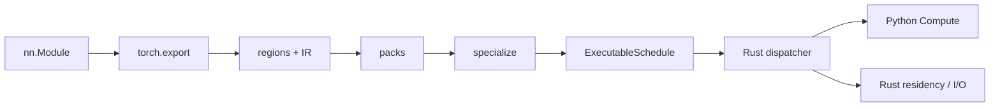
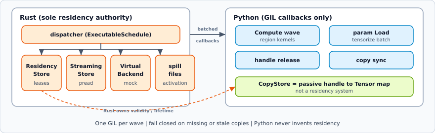
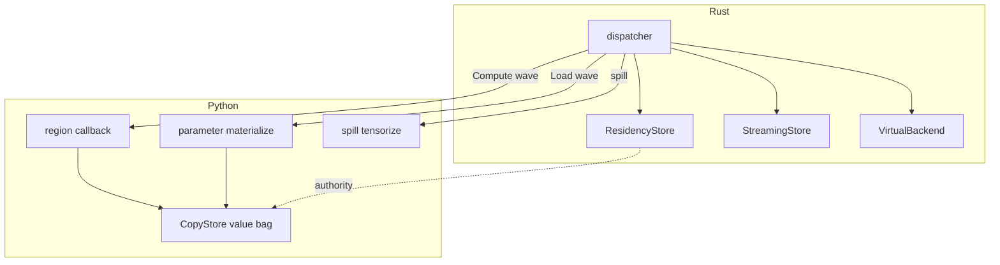

# Architecture

Python control plane. Rust data plane. One immutable schedule is the program.

  

## Pipeline

1. **Portable** — export, partition, lower IR, pack weights (hardware-independent)
2. **Specialize** — discover resources, measure regions, plan placement, build
   `ExecutableSchedule`, fingerprint-gated cache
3. **Run** — `NativeCompiledArtifact` + per-forward `NativeExecutionContext`

  

## Schedule opcodes

`Prefetch` · `Load` · `Transfer` · `RecordEvent` · `WaitEvent` · `Compute` ·
`Evict` · `Release`

- Runtime and simulator share the same schedule model and resource IDs
  (`stream_id`, `copy_engine_id`, `link_id`, `io_queue_id`).
- Load is disk→host. Device residency requires Transfer.
- Missing / stale copies, unknown events, invalid releases fail closed.
- Resident parameters register once; forward does not invent cosmetic Loads.

## Crates

| Crate | Role |
| --- | --- |
| `streamcompiler-core` | Schedule IR, validation, serde |
| `streamcompiler-memory` | Residency, leases, allocations |
| `streamcompiler-runtime` | Dispatcher, context, workers |
| `streamcompiler-simulator` | Deterministic DES |
| `streamcompiler-storage` | Packs, pread, spill, streaming |
| `streamcompiler-virtual-backend` | Simulated accelerators |
| `streamcompiler-profiler` | Cost records |
| `streamcompiler-python` | PyO3 `streamcompiler._native` |

## Python packages

| Package | Role |
| --- | --- |
| `frontend` / `ir` / `analysis` | Export, IR, liveness |
| `hardware` / `planner` / `compile` | Discovery, plan, specialize |
| `backends` / `communication` | Device and collective contracts |
| `runtime` | `CompiledModule`, native bridge, value bag |
| `storage` / `simulator` / `cli` | Packs, DES wrapper, doctor |

Build: `maturin develop --release`. Missing native extension fails closed on
`compile()` / forward.
