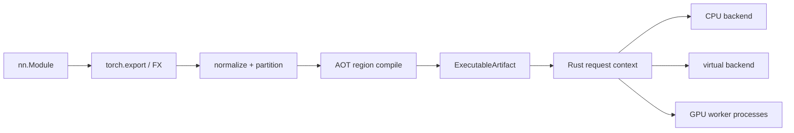

# Architecture

Python control plane. Rust data plane. One immutable **ExecutableArtifact** is the program.



## Control plane (`python/streamcompiler`)

| Package | Role |
| --- | --- |
| root / `config` | `compile`, `load`, `CompileConfig`, `CompiledModule` |
| `frontend/` | export capture, IR lowering |
| `ir/` · `analysis/` · `planner/` | graph IR, alias/liveness, planner |
| `compile/` · `codegen/` | measure, plan, specialize, pack, regions |
| `validation/` · `observability/` · `cli/` | validation, traces, doctor |
| `runtime/` | `CompiledModule`, region callbacks, device workers |

Python does **not** own residency, events, stream ordering, or transfer bookkeeping at runtime.

## Data plane (`rust/`)

| Crate | Role |
| --- | --- |
| `sc-ir` | IDs, opcodes, schedule, validation, artifact schema |
| `sc-runtime` | dispatcher, execution context, scheduler, simulator, profiler |
| `sc-memory` | logical tensors, views, copies, allocations, leases |
| `sc-storage` | packs, prefetch, cache, spill, checksums |
| `sc-backend-api` | device-agnostic backend trait |
| `sc-backend-cpu` | NUMA domains, affinity hooks, host buffers, copy bandwidth |
| `sc-backend-virtual` | deterministic simulated accelerators |
| `sc-python` | PyO3 `streamcompiler._native` |

CUDA/ROCm placement and execute go through the Python torch device backends today. A native `sc-backend-cuda` crate is not required for those paths.

## ExecutableArtifact

Versioned, immutable, non-pickle. Contains:

- normalized graph identity + compatibility version
- compiled compute regions + tensor metadata
- resource requirements + execution schedule
- streams / events / storage manifest / memory plan
- initial persistent residency for loaded parameters
- profile keys

Compilation produces the artifact once. Forward does not rebuild or reinterpret the graph.

Regions marked `attributes.native_launch=true` launch on the virtual/CPU backend without a Python region callback. Torch regions use a Python callback for the region body.

## ExecutionContext (per request)

```text
ExecutionContext {
    artifact, request_id, cancellation,
    instruction_state, ready_queues, events,
    tensors, views, copies, allocations, transfers,
    storage_state, telemetry
}
```

Rust is sole authority for versions, residency, views/aliases, physical allocations, leases, transfers, release, eviction, budgets, events, stream ordering, and storage lifetime.

## Backends

`Backend` discovers devices, queries memory/capabilities, allocates/frees, copies async, launches compiled regions, records/waits events, synchronizes, reports health/memory, cancels queued work.

Resources expose: compute/copy streams, copy engines, links, memory domains, peer-access matrix, NUMA affinity, dtypes, supported artifact formats.

Core never embeds CUDA/ROCm assumptions.

## Serving (`server/`)

Load / unload / warm / infer / cancel / health / readiness / metrics / graceful shutdown.

HTTP (stdlib, no extra deps): `GET /health`, `GET /ready`, `GET /metrics`, `POST /v1/infer`.

```bash
PYTHONPATH=python:. python -m server.cli --listen 127.0.0.1:8080
PYTHONPATH=python:. python -m server.cli --devices virtual_0,virtual_1 --health
```

Bounded queues, backpressure, per-model concurrency, timeouts, request IDs, structured errors/logs, Prometheus metrics, tracing.

## GPU deployment model

```text
Rust coordinator ── owns schedule, topology, request lifecycle, global memory plan
        │
        ├── DeviceWorkerSupervisor (python/runtime) — health / restart / Compute submit
        ├── GPU worker process 0  (one physical GPU)
        ├── GPU worker process 1
        └── ...
```

`ScheduleExecutor` routes Compute to a device worker when `resource` matches a supervised `device_id`. Isolation and restart are exercised with virtual labels and CPU; CUDA workers use the same supervisor path.

## NUMA / affinity

`sc-backend-cpu` discovers NUMA nodes and reports topology for planner placement and host buffers.
