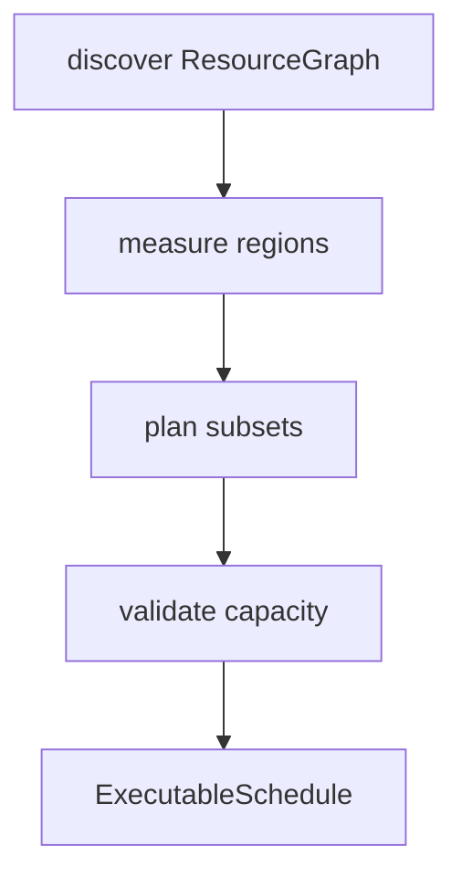

# Heterogeneous hardware

## Resource graph

Discovered independently:

- **Compute** — CPU sockets, NUMA pools, GPUs, accelerators, copy engines
- **Memory** — NUMA RAM, pinned host, unified, device VRAM, disk/NVMe
- **Links** — local, NUMA, PCIe, NVLink / Infinity Fabric / CXL when exposed,
  shared-memory, host-staged, storage

No assumptions of identical GPUs, symmetric bandwidth, one socket, or CUDA-only
stacks. Backend contracts: [backends.md](backends.md).

## Planning

The planner searches device subsets and keeps a device only when it improves the
objective. Working sets that exceed allocatable memory are hard-filtered.

## Two-stage compile

1. **Portable** — export, regions, IR, packs
2. **Specialize** — discover, measure, plan, compile backends, concurrency decision

Respecialize when fingerprint inputs change (hardware, drivers, PyTorch,
resource limits). Sequence: [deployment.md](../product/deployment.md).
