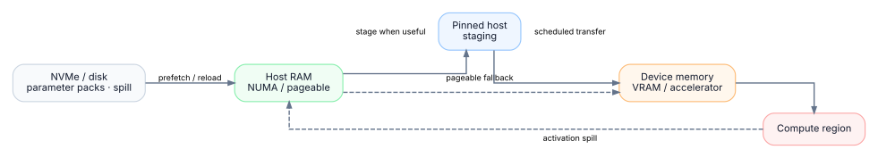

# Heterogeneous hardware

A host is a **resource graph** (compute, memory domains, storage, directed links) — not a fixed GPU topology.

## Resource graph

May include CPU/NUMA, discrete or integrated accelerators, host and device memory, storage tiers, and transfer links. Links carry direction-specific performance when measured; missing data uses explicit fallbacks, not “free” paths.

`A → B` and `B → A` need not match. Planner and DES share one transfer model.

## Memory hierarchy

<p align="center">
  
</p>

Spill reverses the path when the plan requires it.

## Device inclusion

Discovery is not a mandate to use a device. The planner drops a resource when compute benefit loses to transfer cost, memory is infeasible, a required link is missing, or a smaller subset wins the objective.

## Fingerprint and validation

Portable artifacts reuse across hosts; specialized ones refresh when hardware, drivers, PyTorch/runtime, or limits change.

Architecture-neutral CI does not prove every accelerator/driver combo. Before production:

```bash
tensortorrent validate-hardware --output artifacts/validation_report.json
```

See [Deployment](../product/deployment.md) and [Product scope](../product/PRODUCT.md).
