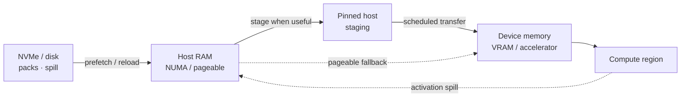

# Heterogeneous hardware

TensorTorrent represents a host as resources and links instead of assuming a fixed GPU topology.

## Resource graph

A resource graph can contain:

- CPU/NUMA compute resources,
- discrete or integrated accelerators,
- host memory domains,
- accelerator memory domains,
- storage tiers,
- transfer links between those resources.

Each link has direction-specific performance data where available. Missing measurements are represented explicitly through fallback/prior information rather than pretending a path is free.

## Why direction matters

`A -> B` and `B -> A` need not have identical latency, bandwidth, or contention behavior. The planner and DES consume the same normalized transfer model so a placement is not ranked with one cost equation and simulated with another incompatible one.

## Memory hierarchy



TensorTorrent can schedule across several tiers when the selected plan and budgets require it:

1. persistent storage / parameter packs,
2. host RAM,
3. pinned host staging where useful,
4. device memory,
5. compute.

Activation spill follows the reverse direction when a host/disk spill plan is emitted.

## Device inclusion

Detection is not an instruction to use a device. The planner can reject a resource when:

- its compute benefit does not offset transfer cost,
- the memory requirement is infeasible,
- a required link/path is unsupported,
- the requested objective is better served by a smaller subset.

This is especially important for unequal GPUs and CPU+accelerator systems.

## Specialization fingerprint

Machine specialization depends on hardware and software characteristics. A portable artifact can be reused, but a specialized artifact may need refreshing when relevant fingerprint inputs change, including hardware, drivers, PyTorch/runtime versions, or resource limits.

## Validation

Architecture-neutral CI cannot establish that every real accelerator/driver combination works. Before production deployment, run target-host validation:

```bash
tensortorrent validate-hardware --output artifacts/validation_report.json
```

See [Deployment](../product/deployment.md).
