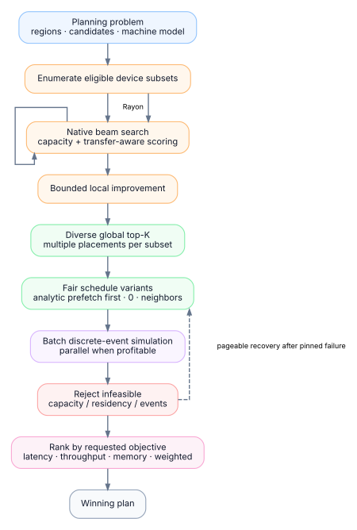

# Planner

TensorTorrent's planner is a native Rust search engine (`crates/tt-planner`). It turns a measured model/machine description into a small set of strong placement candidates. A separate discrete-event simulator then evaluates concrete schedules for those candidates.

<p align="center">
  
</p>

## Why two stages?

Detailed simulation is valuable because transfer contention, overlap, resource serialization, and residency can change the ranking of two superficially similar placements. Running that simulator for every partial search state would make planning prohibitively expensive.

TensorTorrent therefore separates:

- **search score** — cheap enough to evaluate many partial placements;
- **DES score** — higher-fidelity evaluation of a bounded finalist set.

The analytical rank is not treated as ground truth. DES can select a finalist that was not analytical rank 0, including a different placement from the same device subset.

## Planning problem

Before entering Rust, TensorTorrent compacts the specialization state into indexed planning data:

- regions and topological dependencies,
- tensor/activation byte counts,
- parameter/state bytes,
- candidate kernels per region/device,
- measured or estimated compute latency,
- workspace requirements,
- compute and memory resources,
- link bandwidth and latency,
- contention properties,
- memory capacities,
- objective and planner limits.

Hot search loops use integer-indexed native structures rather than repeatedly traversing Python dictionaries.

## Search

The planner evaluates eligible device subsets and performs bounded beam search over region placements. States that violate hard capacity constraints are discarded. Dominance pruning removes states that cannot improve the frontier.

A bounded local-improvement pass can then refine complete placements.

The planner retains multiple distinct terminal placements per competitive subset before the global merge. Distinctness is based on the concrete region/device/backend/kernel/dtype signature, not only the set of devices used.

This matters because two schedules on the same pair of GPUs can have different transfer and contention behavior.

## Finalist selection

`planner_des_candidates` controls the maximum number of distinct placement finalists sent toward detailed simulation. `planner_per_subset_finalists` controls how many terminals may survive from each device subset before the global diverse merge (`0` uses the automatic policy).

The finalist set intentionally balances analytical score and diversity so one subset does not erase every alternative before DES has a chance to evaluate it.

## Schedule variants

For streaming plans, TensorTorrent explores a bounded set of prefetch distances. The analytically preferred distance is evaluated first for every finalist, followed by alternatives such as zero and nearby distances. Variant allocation is breadth-first across finalists so one placement cannot consume the complete simulation budget.

Pinned staging is preferred where appropriate. If a pinned schedule fails detailed capacity simulation and host-staged fallback is allowed, TensorTorrent can evaluate a pageable recovery variant.

## Discrete-event simulation

The simulator consumes the actual `ExecutableSchedule` and machine model. It models:

- instruction dependencies,
- compute-resource availability,
- copy/link serialization and contention,
- transfer latency and bandwidth,
- I/O resource occupancy,
- allocation/residency lifetime,
- peak memory,
- prefetch overlap,
- exposed transfer time,
- critical-path timing.

Compute-region duration comes from measurement or the planner's profile model; DES does not emulate the internals of a kernel instruction by instruction.

Batch DES runs in native Rust and uses a bounded worker pool when the batch is large enough to benefit.

## Objectives

The final feasible schedules are ranked by the requested `Objective`:

- `LATENCY`
- `THROUGHPUT`
- `MEMORY`
- `BALANCED`
- `WEIGHTED`

DES objective scores are authoritative. Analytical rank, finalist rank, prefetch choice, and stable candidate index are only deterministic tie-break inputs when simulated scores are numerically indistinguishable.

## Parallelism

Planner parallelism is enabled by default but adaptive.

```python
config = tt.CompileConfig(
    planner_parallel_subsets=True,
    planner_workers=0,
)
```

Semantics:

- `planner_workers=0`: automatic worker cap based on available parallelism and useful work;
- `planner_workers=1`: force serial native planning;
- `planner_workers=N`: cap the local Rayon planner pool at `N` workers.

Independent subset search is the first parallelization level. For a large single/few-subset beam, intra-subset expansion can engage when the work threshold warrants it. The implementation avoids nested unbounded Rayon pools.

Tiny workloads remain serial when thread-pool overhead is expected to dominate.

## Statistics

Planner/specialization diagnostics distinguish the stages rather than collapsing them into one “rank”:

- `analytic_rank`
- `finalist_rank`
- `simulated_rank`
- `planner_workers_requested`
- `planner_workers_available`
- `planner_workers_used`
- `parallel_search_used`
- `parallel_beam_used`
- `parallel_simulation_used`

The statistics can therefore show when detailed simulation changed the analytical winner.

## What the planner does not do

- It does not exhaustively enumerate every combinatorial plan.
- It does not force every detected accelerator into the result.
- It does not use Python `ThreadPoolExecutor` as the primary planner parallelism mechanism.
- It does not compile every finalist before selection.
- It does not hide transfer cost inside backend execution calls.
