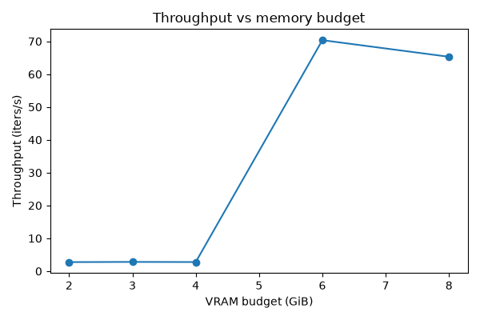
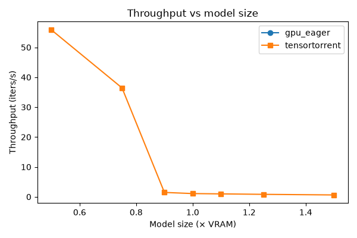

# Benchmarks

TensorTorrent's public suite answers two questions:

1. **overhead when a workload already fits one device**, and
2. **feasibility / capacity when the model (or budget) does not**.

Evidence labels:

| Label | Meaning |
| --- | --- |
| **MEASURED** | Wall-clock numbers from the host recorded below |
| **SIMULATED** | Planner / discrete-event estimates only |
| **SUPPORTED BUT UNMEASURED** | Path exists; this host lacked hardware or a completed run |
| **PLANNED** | Intended coverage; not claimed |

Never treat SIMULATED or PLANNED rows as published performance. Do not invent “faster/slower” claims without a MEASURED number in the same table.

## Reproduce

```bash
uv sync --extra dev --extra bench

# Light smoke (fit / budget / hetero only — no multi-GiB DeepMLP cliff)
python -m benchmarks.smoke

# One suite at a time (recommended — bounds host RSS)
python -m benchmarks.public --suite fit
python -m benchmarks.public --suite deepmlp
python -m benchmarks.public --suite budget
python -m benchmarks.public --suite crossover
python -m benchmarks.public --suite transformer --model-id Qwen/Qwen3-8B --seq-len 16
python -m benchmarks.public --suite hetero

# All suites: each in a fresh subprocess
python -m benchmarks.public --suite all
```

JSON + `REPORT.md` + plots land under `benchmarks/results/<timestamp>/`. Legacy suite names remain on `python -m benchmarks.run` (also isolates `--suite all`).

Focused microbenches stay under `bench/` (`compare_baselines.py`, `planner_native_bench.py`, `perf_breakdown.py`, `oversized_model.py`).

## Methodology

- Warm up before timing; synchronize CUDA around timed regions.
- Report median (p25/p75/p95 in JSON); separate compile/planning time from steady-state forward.
- Record host, GPU, RAM, torch/CUDA, git commit in `environment.json`.
- Peak device memory: `torch.cuda.max_memory_allocated`. Host peak: `ru_maxrss` (process lifetime — can include earlier approaches in the same process).
- Numerical checks vs eager reference. DeepMLP: `allclose` atol=rtol=1e-3. BF16 transformer: cosine + argmax agreement thresholds.
- Same dtype / batch / shapes across approaches in a row.
- OOMs and failures recorded explicitly with notes / configs.
- GPU-eager OOM probes and each crossover size run in child processes so RSS cannot stack.
- Weights for multi-approach DeepMLP suites are reloaded from a tempfile (one live copy at a time).
- Host abort if free RAM < ~3× weights + 4 GiB headroom (compile peak).

## Published snapshot (MEASURED)

Hardware: Intel i7-12700H, 61 GiB RAM, RTX 3070 Ti Laptop (8.22 GiB), PyTorch 2.13.0+cu130, driver 595.84.
Commit `c25e21a380de`. Results directory: `benchmarks/results/public_launch_20260809/`. Measured 2026-08-09.

Plots (same run):





### Fit-in-VRAM overhead (CUDA)

`rel` = TensorTorrent / eager. Lower is better for TensorTorrent.

| Workload | Eager ms | `torch.compile` ms | TensorTorrent ms | rel | Peak VRAM MB | Evidence |
| --- | ---: | ---: | ---: | ---: | ---: | --- |
| MLP 512×8 | 0.23 | 0.27 | 0.97 | 4.19× | 17 | MEASURED |
| Transformer 256 | 0.26 | 0.29 | 0.92 | 3.60× | 15 | MEASURED |
| MLP 2048×8 | 0.70 | 0.82 | 1.20 | 1.70× | 143 | MEASURED |

When the model fits one GPU, eager / `torch.compile` win on this host. Overhead shrinks as the forward gets heavier.

### DeepMLP larger than VRAM (1.50×)

Width=4096, depth sized to **12.35 GB** parameters (~1.50× device VRAM). TensorTorrent: host-resident weights, CUDA Transfer/Evict (`allow_cpu=False`). Instrumentation: **100%** region compute on `cuda_gpu_0`, peak activation **256 KiB**, H2D **12.35 GB** / D2H **12.35 GB** (~49 transfers), transfer dominates wall (~98%). Peak allocated VRAM **0.61 GB** — working set for one region + activation, not the full parameter footprint.

| Approach | Median ms | Peak VRAM GB | Peak host GB (RSS) | Result | Evidence |
| --- | ---: | ---: | ---: | ---: | --- |
| GPU eager | — | — | — | CUDA OOM | MEASURED |
| TensorTorrent (CUDA) | 1375 | 0.61 | 25.7 | completed, max abs err ~0 | MEASURED |
| CPU eager | 1092 | 0.08 | 38.0 | completed | MEASURED |
| Accelerate `device_map=auto` + `max_memory={0:5GiB, cpu:48GiB}` | 899 | 5.38 | 38.0 | completed | MEASURED |

On this PCIe laptop, when the model still fits host RAM, Accelerate offload and CPU eager beat TensorTorrent on latency. TensorTorrent’s claim here is **capacity with GPU compute** (peak VRAM 0.61 GB, gpu_frac=1.0), not a throughput win. Planner predicted ~2.07 s; measured median ~1.37 s.

### Qwen/Qwen3-8B beyond VRAM (MEASURED)

Revision `b968826d9c46dd6066d109eabc6255188de91218`, bf16, seq_len=16, batch=1. Parameters **16.38 GB** (~1.99× VRAM).

| Approach | Median ms | Peak VRAM GB | Result | Evidence |
| --- | ---: | ---: | ---: | --- |
| GPU eager | — | — | not attempted in-process (params > 0.95×VRAM) | MEASURED |
| TensorTorrent (CUDA) | 2854 | 1.33 | completed; cosine 0.9997, argmax 15/16, max abs err 0.44 (bf16) | MEASURED |
| CPU eager | 3287 | 0.00 | completed | MEASURED |
| Accelerate `device_map=auto` + `max_memory={0:6GiB, cpu:40GiB}` + offload folder | — | — | CUDA OOM (tried to allocate ~1.16 GiB with ~1.19 GiB free) | MEASURED |

TT instrumentation: gpu_frac=1.0, H2D ~16.38 GB, ~401 transfers. On this host TensorTorrent beats CPU eager for this HF forward; Accelerate’s configured offload still OOM’d.

### Memory budget curve (MEASURED)

~0.45×-VRAM DeepMLP under absolute `vram_budget_bytes` (GiB):

| Budget GiB | Median ms | Throughput iters/s | Transfer GB | GPU compute % | Evidence |
| --- | ---: | ---: | ---: | ---: | --- |
| 8.0 | 15.3 | 65.3 | 3.76 | 100% | MEASURED |
| 6.0 | 14.2 | 70.4 | 3.76 | 100% | MEASURED |
| 4.0 | 360 | 2.78 | 7.52 | 100% | MEASURED |
| 3.0 | 355 | 2.82 | 7.52 | 100% | MEASURED |
| 2.0 | 362 | 2.76 | 7.52 | 100% | MEASURED |

Below ~6 GiB budget on this link, Transfer/Evict doubles transfer volume and latency jumps ~25×.

### Model-size crossover around the VRAM wall (MEASURED)

DeepMLP width=4096, sizes as multiples of physical VRAM. Each point = child process. GPU eager column is OOM-probe only (ok ⇒ model fit VRAM; not a timed forward).

| Size × VRAM | GPU eager | TensorTorrent ms | Evidence |
| --- | --- | ---: | --- |
| 0.50 | fits | 17.9 | MEASURED |
| 0.75 | fits | 27.5 | MEASURED |
| 0.90 | OOM | 680 | MEASURED |
| 1.00 | OOM | 918 | MEASURED |
| 1.10 | OOM | 1016 | MEASURED |
| 1.25 | OOM | 1204 | MEASURED |
| 1.50 | OOM | 1586 | MEASURED |

### Heterogeneous / multi-GPU

| Configuration | Evidence |
| --- | --- |
| GPU+CPU allowed placement (DeepMLP) | MEASURED — planner placed on `cuda_gpu_0` |
| 2× GPU on one host | SUPPORTED BUT UNMEASURED (this laptop has 1 GPU) |
| ROCm / XPU | SUPPORTED BUT UNMEASURED here |

## Planner microbench (separate)

```bash
uv run python bench/planner_native_bench.py
```

Planner timings are planning-cost measurements, not forward throughput.

## What is still missing from public evidence

- Multi-GPU utilization / interconnect numbers on real multi-GPU hosts
- Autoregressive generation length (this transformer run is a fixed-shape logits forward)
- Heads where Accelerate offload succeeds on larger HF models under tighter `max_memory` maps
- Better H2D/compute overlap under beyond-VRAM (PCIe-bound on this laptop; DeepMLP transfer wall ~98%)
- Per-approach host-peak RSS (current `ru_maxrss` is process-lifetime)
